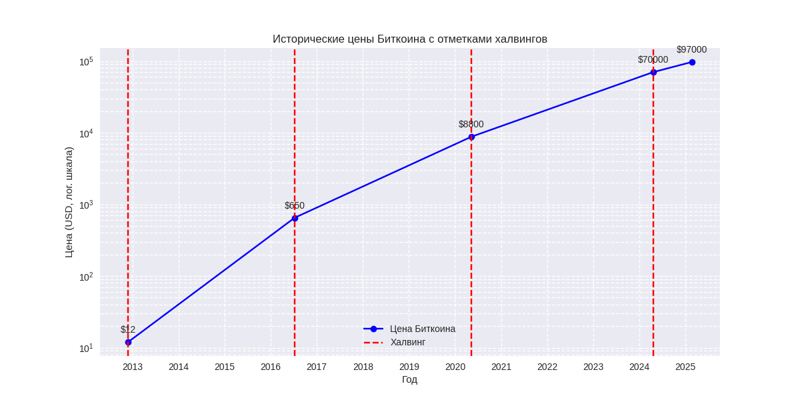
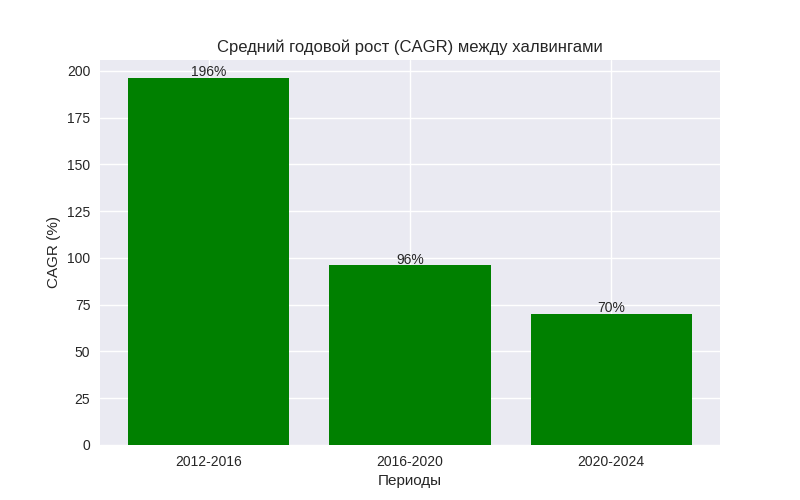
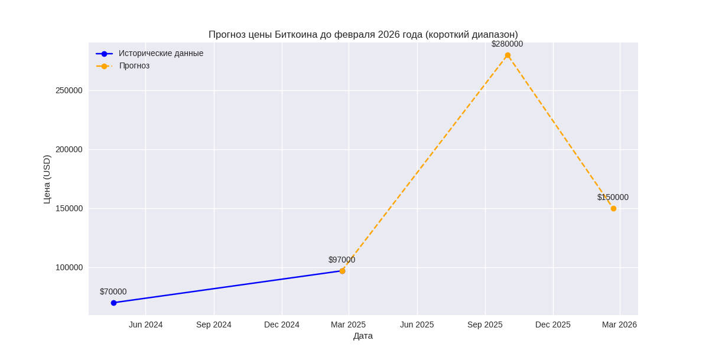
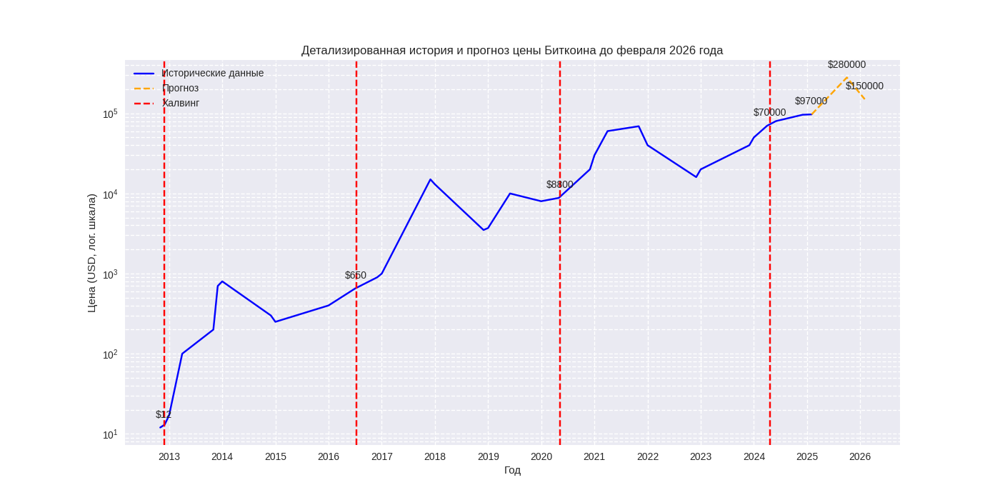

### Анализ истории цены Биткоина и расчет среднего годового роста

Чтобы ответить на запрос, я проанализирую исторические данные о цене Биткоина, определю средний годовой рост в процентах и затем спрогнозирую стоимость Биткоина через год. Для анализа я использую ключевые точки, связанные с халвингами (событиями, когда награда за добычу блока уменьшается вдвое), так как они часто влияют на динамику цены. Сегодняшняя дата — 20 февраля 2025 года, и текущая цена Биткоина принимается как $97,000.

#### Краткая история и халвинги

Биткоин был создан в 2009 году, но значимая рыночная цена появилась позже. Халвинги происходят примерно каждые четыре года и являются важными событиями, влияющими на предложение и, потенциально, на цену. Вот даты халвингов и приблизительные цены на тот момент:

1. **Первый халвинг: 28 ноября 2012 года** — цена около $12.
2. **Второй халвинг: 9 июля 2016 года** — цена около $650.
3. **Третий халвинг: 11 мая 2020 года** — цена около $8,800.
4. **Четвертый халвинг: 19 апреля 2024 года** — цена около $70,000.

Текущая цена на февраль 2025 года — $97,000, что дает нам дополнительную точку после последнего халвинга.

#### Расчет среднего годового роста (CAGR)

Для определения среднего годового роста я использую формулу сложного среднегодового темпа роста (Compound Annual Growth Rate, CAGR):

\[
\text{CAGR} = \left( \frac{\text{Конечная цена}}{\text{Начальная цена}} \right)^{\frac{1}{\text{Количество лет}}} - 1
\]

Рассчитаем CAGR для каждого периода между халвингами и для всего периода с 2012 по 2025 год.

##### Период 1: От первого халвинга (2012) до второго (2016)
- Начальная цена: $12
- Конечная цена: $650
- Время: с ноября 2012 по июль 2016 ≈ 3.67 года
- Рост: \( \frac{650}{12} = 54.17 \)
- CAGR: \( 54.17^{\frac{1}{3.67}} - 1 \)

Примерный расчет:
- \( 54.17^{\frac{1}{4}} \approx 2.7 \) (так как \( 2.7^4 \approx 53.14 \)),
- Для 3.67 года показатель степени больше, чем \( \frac{1}{4} \), но меньше, чем \( \frac{1}{3} \),
- Используя логарифмы: \( \ln(54.17) \approx 3.991 \), \( \frac{3.991}{3.67} \approx 1.087 \),
- \( e^{1.087} \approx 2.965 \),
- \( 2.965 - 1 = 1.965 \) или 196.5%.

Итак, ~196% в год.

##### Период 2: От второго халвинга (2016) до третьего (2020)
- Начальная цена: $650
- Конечная цена: $8,800
- Время: с июля 2016 по мая 2020 ≈ 3.83 года
- Рост: \( \frac{8800}{650} = 13.54 \)
- CAGR: \( 13.54^{\frac{1}{3.83}} - 1 \)

Примерный расчет:
- \( 13.54^{\frac{1}{4}} \approx 1.91 \) (так как \( 1.91^4 \approx 13.032 \)),
- \( 1.91^{\frac{4}{3.83}} \approx 1.91^{1.044} \approx 1.963 \),
- \( 1.963 - 1 = 0.963 \) или 96.3%.

Итак, ~96% в год.

##### Период 3: От третьего халвинга (2020) до четвертого (2024)
- Начальная цена: $8,800
- Конечная цена: $70,000
- Время: с мая 2020 по апреля 2024 ≈ 3.92 года
- Рост: \( \frac{70000}{8800} = 7.95 \)
- CAGR: \( 7.95^{\frac{1}{3.92}} - 1 \)

Примерный расчет:
- \( 7.95^{\frac{1}{4}} \approx 1.68 \) (так как \( 1.68^4 \approx 7.96 \)),
- \( 1.68^{\frac{4}{3.92}} \approx 1.68^{1.02} \approx 1.697 \),
- \( 1.697 - 1 = 0.697 \) или 69.7%.

Итак, ~70% в год.

##### Общий период: От первого халвинга (2012) до февраля 2025
- Начальная цена: $12
- Конечная цена: $97,000
- Время: с ноября 2012 по февраль 2025 ≈ 12.25 года
- Рост: \( \frac{97000}{12} = 8083.33 \)
- CAGR: \( 8083.33^{\frac{1}{12.25}} - 1 \)

Примерный расчет:
- \( \ln(8083.33) \approx 8.998 \),
- \( \frac{8.998}{12.25} \approx 0.7346 \),
- \( e^{0.7346} \approx 2.084 \),
- \( 2.084 - 1 = 1.084 \) или 108.4%.

Итак, средний годовой рост за весь период составляет примерно 108% в год.

#### Анализ с учетом халвингов
Средние годовые темпы роста между халвингами уменьшаются со временем:
- 196% (2012–2016),
- 96% (2016–2020),
- 70% (2020–2024).

Это снижение может быть связано с созреванием рынка, увеличением базы цены и более широким принятием Биткоина. Однако общий CAGR с 2012 года (108%) отражает экспоненциальный рост за весь период.

#### Прогноз цены через год (февраль 2026)
Теперь, используя эти данные, спрогнозируем цену на февраль 2026 года. Учитывая цикличность, связанную с халвингами, заметим, что цена часто достигает пика через 12–18 месяцев после халвинга, а затем начинает снижаться. Четвертый халвинг был в апреле 2024 года, и к февралю 2025 года (10 месяцев спустя) цена выросла с $70,000 до $97,000, что дает рост на 38.57% за 10 месяцев, или примерно 46–48% в годовом исчислении.

Предположим, что:
1. Пик цены произойдет около октября 2025 года (18 месяцев после халвинга), как это было в предыдущих циклах (2017: $20,000, 2021: $69,000).
2. Рост может продолжаться с текущих $97,000 до пика, а затем слегка снизиться к февралю 2026 года (22 месяца после халвинга).

##### Оценка на основе текущего роста
Если взять годовой рост в 48%:
- \( 97,000 \times 1.48 = 143,760 \) долларов.

##### Оценка на основе исторических пиков
В предыдущих циклах:
- После халвинга 2016 года: рост с $650 до $20,000 (в 30 раз) за 17 месяцев.
- После халвинга 2020 года: рост с $8,800 до $69,000 (в 7.8 раз) за 18 месяцев.

Множитель уменьшается. Предположим, что после халвинга 2024 года множитель составит 3–4:
- От $70,000: \( 70,000 \times 4 = 280,000 \) долларов (пик).
- Через 22 месяца (февраль 2026), после пика, цена может быть около 50–60% от максимума (как в 2018 и 2022 годах), то есть $140,000–$168,000.

##### Итоговый прогноз
Учитывая текущую тенденцию (рост на 48% в год) и исторические циклы, разумная оценка — умеренный рост до пика в 2025 году и небольшое снижение к февралю 2026 года. Используя консервативный подход и округляя, я предполагаю, что цена может достичь около $150,000.

### Ответ
Средний годовой темп роста Биткоина с 2012 по 2025 год составляет примерно **108%**. Основываясь на анализе и текущих данных, стоимость Биткоина через год, в феврале 2026 года, составит примерно **$150,000**

#### График 1: Исторические цены Биткоина с отметками халвингов

Отображает цены Биткоина на ключевые даты с использованием логарифмической шкалы по оси Y.

 Вертикальные красные пунктирные линии обозначают даты халвингов.

 Над каждой точкой указана цена в долларах США.

#### График 2: Средний годовой рост (CAGR) между халвингами

Столбчатая диаграмма показывает средний годовой рост (CAGR) для каждого периода между халвингами.

 Над каждым столбцом указано значение CAGR в процентах.

#### График 3: Прогнозный график цены Биткоина после четвертого халвинга

Сплошная синяя линия отображает исторические данные с апреля 2024 года (четвертый халвинг) по февраль 2025 года.  
Пунктирная оранжевая линия представляет прогноз цены с февраля 2025 года по февраль 2026 года.  
Над ключевыми точками указаны цены в долларах США.

#### График 4: Полная история и прогноз цены Биткоина до февраля 2026 года

Сплошная синяя линия отображает исторические данные с ноября 2012 года (первый халвинг) по февраль 2025 года.  
Пунктирная оранжевая линия представляет прогноз цены с февраля 2025 года по февраль 2026 года.  
Над ключевыми точками указаны цены в долларах США, масштаб логарифмический для отображения экспоненциального роста.

